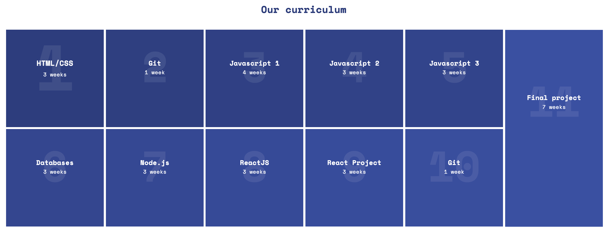

# 🎯 Getting started

First, please fill in your preferences [**here**](https://forms.gle/cefozDVktRJ5nAzGA) to indicate what skills you feel confident to share**.** :brain::raised\_hands:&#x20;

## Most crucial learning goals

We want our students to be able to work in a tech company in Denmark. Technical skills are important, but just as much is an understanding of what the job of a web-developer looks like. Collaboration, teamwork, an inquisitive mindset and **asking tons of questions** are crucial "interpersonal skills" that we want to encourage _over and over_. Relating what you explain in class to your daily tasks at work is also _always_ super useful.

## Slack

Our Slack workplace is the main communication tool we use. It has channels for every class, the main goal here is that we support students with questions/their homework during the week. You don't have to join all channels, but please join the one of the class that you are currently teaching or helping out with. If you are not invited to Slack yet: Ask our staff to add you 👨‍💻

## FAQ

* Q: **How much time does mentoring require per week?**\
  A: It depends on the role. But aim at about -10 hours per week.
* Q: **Do I need to be a working professional to teach?**\
  A: No, you don't need to be a working professional, but it is a big plus. We want our students to learn from people who work with the technologies in our curriculum on a daily basis and know the challenges of the market.
* Q: **Will I be teaching all by myself?**\
  A: No, teaching always happens in small groups. This allows for less pressure on the individual, split responsibility and a broader perspective for our students.
* Q: **Do I have to teach exactly like it says in the repo?**\
  A: No, you can basically teach however you best see fit. We have learning goals we want to complete in each module and that the next module builds on. The students will work on the learning goals in the homework, therefore is very important that you teach those. You also don't need to reinvent the wheel about how to teach (but you can if you want to), all the material (code examples, exercises and documentation) is there in the lesson-plan if you prefer to follow existing instructions.
* Q: **When do the classes take place?**\
  A: Sundays 12:00 - 16:00

## So how is the curriculum structured?

Here is an overview of the [**curriculum**](https://github.com/HackYourFuture-CPH/curriculum)

As a mentor you can book a specific module where you are responsible for the class reaching the learning goals during that time. Ask the staff for the schedule and be proactive about saying what modules you would like to teach.

## Modules

* All modules have their own repository in our Github organization.
* Check out the overview of our [**curriculum**](https://github.com/HackYourFuture-CPH/curriculum). Here you can find information about how and what we teach.
* We divided everyone in our organization into teams, we have a teachers team, a team for every class etc. which all have different permissions.
* We have a private repository where fellow teachers share their [**teaching-tips-and-tricks**](https://github.com/HackYourFuture/teaching\_tips\_tricks), if you are new to teaching or are just curious on what they think works well in class, take a look.
* Please contribute and help improve the curriculum. Just make a Pull Request or write the curriculum responsible!

## Workshops/Master Classes

From time to time we organize workshops or Master Classes for our alumni in which we go into detail with a specific topic. We have so far organized masterclasses on TypeScript, React Native, Serverless, .NET development, Web Bluetooth/Web USB, Web Content Management & CMS Systems, Docker and many more. If you have a suggestion for a topic or want to build a lesson plan for a new Master Class or workshop, please let us know! You can think along the lines of this [Masterclass template](https://github.com/HackYourFuture-CPH/masterclass-template).&#x20;

## Roles

We distinguish between [Code Mentors](roles/technical-mentors/) & [Career Mentors](roles/career-mentors/), but you can of course also be both. Code Mentors are usually professional developers, whereas Career Mentor roles sometimes only require expertise related to effective job-searching & interviewing for tech jobs.

## The Volunteer Journey

<figure><figcaption>
This is how new volunteers typically progress through volunteer roles at HYF.
</figcaption></figure>
