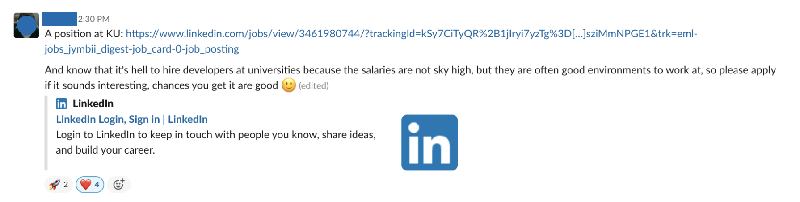

# Flexible tasks

There's always _something_ to do, but not always do availability and roles overlap perfectly for our volunteers, so here's an overview of what you can do when your schedule might not allow you to immediately commit to a 3-week module.

### #need-a-review

On our Slack workspace you can find a channel "**#need-a-review**" dedicated to homework submissions from students that have not yet gotten reviewed. This task is basically the same as [Homework Reviewer](homework-reviewer.md), just that it's not time-bound and you can focus on a single homework submission, instead of several.\
\
We estimate the time commitment to be between **30-60 minutes** here, as you would be using some time on understanding the exercises the student was trying to solve before you go in to add feedback to their code.

<figure><figcaption>
A student posting a homework submission that hasn't gotten feedback after 7 days in the #need-a-review channel. 
</figcaption></figure>

Once a homework submission has been posted in **#need-a-review** any volunteer can pick it up, so when you start reviewing the code, leave an emoji like 👍 so others know that you started working on it. Once you are finished, mark it with ✅.

### Career Mentoring

We group different volunteering roles that have to do with preparing our graduates for the job-market & landing their first job under this category. You can read more about all the different roles [here](../career-mentors/).\
\
A quick and simple way to help out is to check the **#jobapplication-feedback-support** channel and give feedback on the CV's posted in there.&#x20;

Similarly, posting relevant job ads into our **#jobs-jobs-jobs** channel is a small, but really useful way to support our students and graduates in finding quality jobs.

<figure><figcaption>
An example of a helpful post. An unconventional employer and a few lines explaining why it's a good opportunity.
</figcaption></figure>

